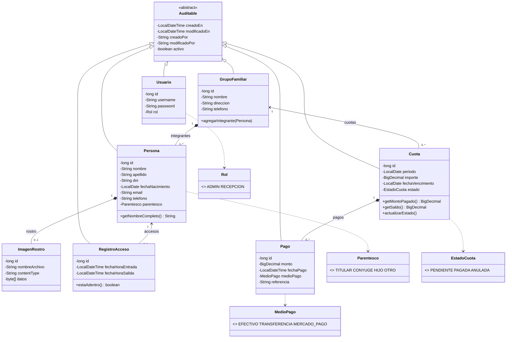

# Diagrama de clases rediseñado

Se agregó el módulo de **cuotas y pagos por familia** (medios: Efectivo, Transferencia, Mercado Pago), la
**auditoría** de todas las entidades y el **usuario del sistema** (seguridad).
Para verlo: pegar el bloque en <https://mermaid.live> o en draw.io (Extras → Editar diagrama → Mermaid).

## Decisiones de diseño

| Decisión | Justificación |
|---|---|
| `Persona` única con `Parentesco` | Entrada/salida y foto aplican a cualquier persona; el titular se deriva del parentesco. |
| `ImagenRostro` separada y LAZY | Los listados no descargan los bytes de las fotos. |
| `RegistroAcceso` con salida nullable | Una fila por visita; salida `null` = la persona está adentro. |
| `Cuota` por familia y período, 1–* `Pago` | Permite pagar con uno o varios medios; la cuota pasa a PAGADA al cubrir el importe. |
| `MedioPago` enum + `referencia` | Los 3 medios comparten atributos; herencia sería sobreingeniería. Mercado Pago: se registra el ID de operación (sin integración real con la API). |
| Auditoría con Spring Data JPA + baja lógica | Conserva historial y registra quién/cuándo creó y modificó. |
| Pagos inmutables (solo se anulan) | Trazabilidad contable. |
